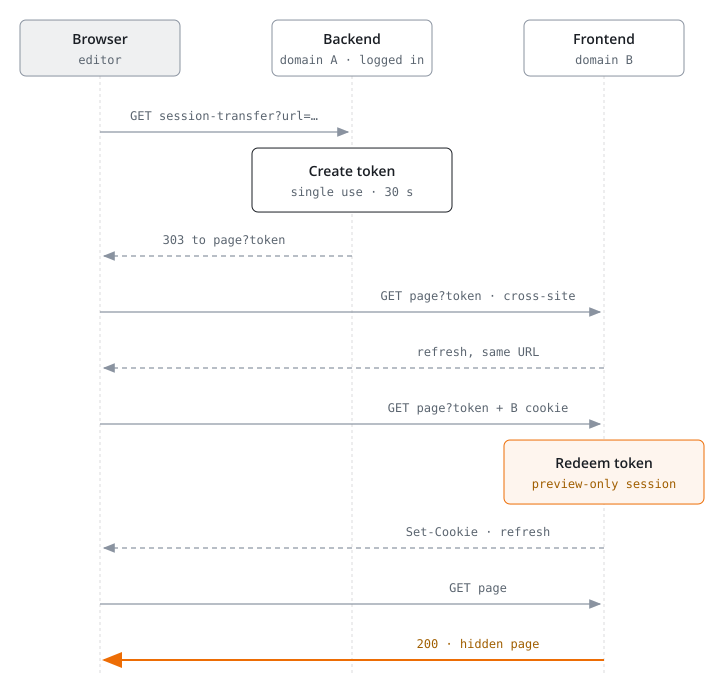

<h1 align="center">Cross-domain preview</h1>

<em>Preview hidden pages of TYPO3 sites on other domains than the one you used to log in to the backend.</em>

 

  
  
  
  

## The problem

The backend session cookie belongs to the domain you logged in on. In an
installation with sites on several domains, "View webpage" for a hidden page
of another site shows "Page not found", because the browser sends no backend
session to that domain ([Forge #110664](https://forge.typo3.org/issues/110664)).

## How it works

<picture>
  <source media="(max-width: 700px)" srcset="diagrams/how-it-works-narrow.svg">
  
</picture>

1. "View webpage" (and the context menu, "Save and view", live search) for a
   page on another domain first goes through a backend route on the current
   domain.
2. That route creates a single-use token, valid for 30 seconds and bound to
   the user, the target domain and the IP lock settings, and redirects to the
   page.
3. A frontend middleware on the target domain redeems the token and starts a
   session there.

The new session only works for the frontend preview. The backend on that
domain ignores it and still asks for a login. An existing backend login on the
target domain is kept.

Not handled on purpose:

- The Preview module, because browsers do not store the session cookie in a
  cross-site iframe.
- "Switch user" sessions.

## Installation

    composer require wazum/cross-domain-preview

Then update the database schema. The tokens are stored in the cache
`cross_domain_preview`, which uses the database by default. With several web
servers and a local cache backend, configure a shared backend for this cache.
